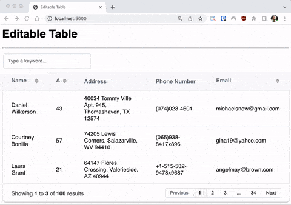

# flask-gridjs
Render beautiful tables in your Flask templates with grid.js

## Resources

- Learn how to use this code: [Go to blog post](https://blog.miguelgrinberg.com/post/beautiful-flask-tables-part-2).
